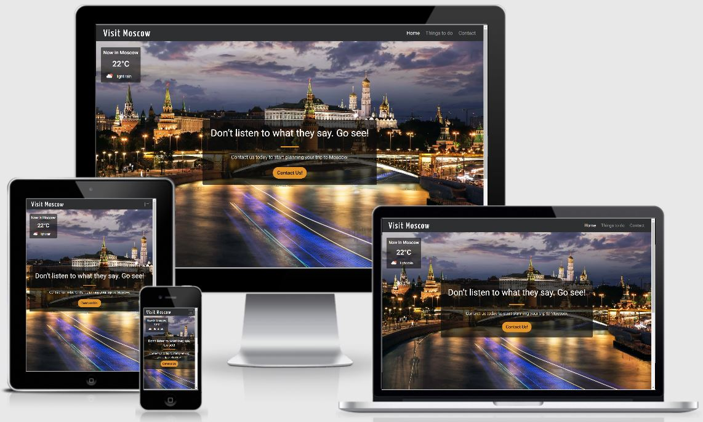

`python3 -m http.server`

# Visit Moscow Website

[View the live project here.](https://victoriashalabaeva.github.io/Visit-Moscow/)

*Visit Moscow* is an interective website that guides through the most popular sightseeings of Moscow. The website is aimed for tourists who plan to visit the capital of Russia and look for a consize summery on the locations worth to see first.

The website is designed to be responsive and accessible on a range of devices, making it easy to navigate through.



## User Experience (UX)

### User stories

  - **As a tourist:**

    - I want to see a quick overview on the most popular sightseeings and attractions of Moscow.
    - I want to read more information and have a visual representation of the advertized locations.
    - I want to see different locations on a map to have a better undestanding on how much far the locations are one from each other.
    - I want to have an opportunity to ask for more info, advice or recommendation in organizing my trip.

  - **As a general user:**
    
    - I want to be able to easily navigate throughout the site to find content.
    - I want to open the website from different devices (desktop/laptop/mobile device).
      
### Design

  - **Colour Scheme**

    The main colours used are dark grey (#2d2f31), light grey (#494947), light yellow (#e8e3c9) and orange (#e3952a).

  - **Typography**

    The Roboto and Yanone Kaffeesatz (Navbar heading) fonts are the main fonts used throughout the whole website with Sans Serif as the fallback font in case for any reason the font isn't being imported into the site correctly. Roboto is a clean font used frequently in programming, so it is both attractive and appropriate.

  - **Imagery**
     
    The large background images are designed to be striking and catch the user's attention demonstrating Moscow views.

### Wireframes

  - *Home* page - [View](assets/pdf/home-page.pdf)

  - *Things to do* page - [View](assets/pdf/things-to-do-page.pdf)

  - *Contact* page - [View](assets/pdf/contact-page.pdf)

## Features

### Existing Features

- The website is responsive on all device sizes (down to 280 px).

- The website contains a Bootstrap responsive navigation header; a collapse plugin groups and hides navbar content.

- The website contains three pages including *Home*, *Things to do* and *Contact* pages. This thematic division facilitates the website navigation.

- The *Home* page:

  - contains an appealing background image and a Bootstap jumbotron-style component that catches the user's attention. 
  - shows an actual Moscow weather.
  - Bootstrap buttons linking to *Things to do* and *Contact* pages.

- The *Things to do* page:

  - contains an interective google map interface to discover the most popular touristic attractions. By clicking on one of the four buttons (*Historic Sites*, *Museums*, *Parks* and *Shopping*), the corresponding marker distribution shows up. Further, by clicking on each marcker, the info window with a photo and description appear.

- The *Contact* page:

  - contains a contact form to submit a message. 

### Features Left to Implement

- a *Search Bar* through which a user can search content of their concern within the website.

- a weather info in real time (currently weather info updates only the *Home* page is refreshed)

## Technologies Used

### Languages Used

- HTML5

- CSS3

- JS

### Frameworks, Libraries & Programs Used

1. [Bootstrap 4.1.3:](https://getbootstrap.com/docs/4.1/getting-started/introduction/)

   - Grid System to make the site responsive,

   - Navbar to make a responsive navigation header,

   - Jumbotron-style component for calling extra attention to featured content or information.
   
2. [Google Fonts:](https://fonts.google.com/)

   Google fonts Roboto and Yanone Kaffeesatz were used on all pages throughout the project.

3. [jQuery:](https://jquery.com/)

   jQuery was used in javascript codes for the media query and detection of iOS devices; within Bootstrap to make the navbar responsive.

4. [Git:](https://git-scm.com/)

   Git was used for version control. 

5. [GitPod:](https://www.gitpod.io/)

   GitPod was used as an IDE platform for website realization.

6. [GitHub:](https://github.com/)

   GitHub is used to store the project code after being pushed from GitPod.

7. [Balsamiq:](https://balsamiq.com/)

   Balsamiq was used to create wireframes during the design process.

10. [Google Map API:](https://google-map-generator.com/)

   Google Map Generator was used for the Google map integration. 

## Testing

The W3C Markup Validator and W3C CSS Validator Services were used to validate every page of the project to ensure there were no syntax errors.

- [W3C Markup Validator](https://validator.w3.org/). Please see Figure S1 in [Supp Info](supp-info.md) for the result.
- [W3C CSS Validator](https://jigsaw.w3.org/css-validator/). Please see Figure S2 in [Supp Info](supp-info.md) for the result.

### Testing User Stories from User Experience (UX) Section

Please see [Here](testing_user_stories.md) to find the user stories testing with corresponding screenshots.

### Testing Functionality, Usability and Responsiveness

The manual testing is described [Here](manual_testing.md).

### Further Testing

- The website was checked for performance with [Lighthouse](https://developers.google.com/web/tools/lighthouse) in Chrome DevTools (see results in Figure S3 in [Supp Info](supp-info.md)).

- The Website was tested on Google Chrome, Mozilla Firefox and Microsoft Edge browsers.

- The screen sizes and devices tested in Chrome DevTools include:

    - 1920 x 1080 
    - 1600 x 992
    - 1440 x 900
    - 1366 x 768
    - 1280 x 800
    - iPad Pro (1024 x 1366) 
    - Nexus 10 (800 x 1280)
    - iPad (768 x 1024)
    - Surface Duo (540 x 720)
    - iPhone 6/7/8 Plus (414 x 736)
    - Pixel 2 (411 x 731)
    - iPhone 6/7/8 (375 x 667)
    - Nexus 4 (384 x 640)
    - iPhone X (375 x 812)
    - Galaxy S5 (360 x 640)
    - iPhone 5/SE (320 x 568)
    - Galaxy Fold (280 x 653)

- Devices physically tested include:

  - Desktop 
  - Laptop
  - iPhoneXR 
  - Huawei Mate 20 
    
### Bugs

  - Two carousels (*News* section on the *Home* page and *Equipment* section on the *Research* page) have a "strange" feature in Microsoft Edge and Mozilla Firefox browsers. When the slides are scrolling it is accompanied by a slight trembling of the slides (hardly noticeable in Mozilla Firefox, more evident in Microsoft Edge).
  
  - During the development process, the particular difficulty was met with:
  
      - Formatting the *News* section on the *Home* page:
          - large amount of content, 
          - cards integration inside a carousel,
          - size optimization for different devices,
          - fitting images with different dimensions and aspect rations within a unique size container in cards. 

      - Working with the hero images, in particular the hero images on *Research* page and *Publications*. 
  
#### Fixed bugs

1. All pages of the website had an additional white space that was causing a horizontal page scrolling (please see Figure S4 in [Supp Info](supp-info.md)).
       
   It was discovered that the hero image container had an extra padding and margin space. 
       
   The issue was solved by adding additional classes to standard Bootstrap .row and .col classes in order to style specifically the containers of the hero images.

2. It was noticed that for screen sizes less than 360 px there is an overlap between photos and text on the right (see Figure S5 in [Supp Info](supp-info.md))
       
   .col-5 containing photos was changed to .col-6.
       
   Image width was changed to 135 px and 130 px for maximum screen sizes 368 px and 300 px, respectively.

3. When trying to click a link within a text body of the cards in the *News* section on the *Home* page, it was noticed that instead of clicking the link one is clicking the *Back*/*Forward* buttons of the carousel.
       
   This happened because the active (clickable) area of buttons was too large, overlapping with cards content (see an example in Figure S6 in [Supp Info](supp-info.md)).
       
   Buttons width was decreased from 30% to a default value 15%. 30% (for screen sizes > 1400 px) and 5% (for screen sizes < 645 px) were introduced exclusively for styling purposes). 5% for smaller devices was left as it does not interfere with the cards content.

4. On the devices with a maximum screen size 768 px, it was noticed that on the *Research* page the carousel bottom jumps when scrolling slides of the carousel.
       
   That was happening due to the different amount of text.
       
   The text container height was fixed to 100 px and 130 px for the maximum screen sizes 550 px and 280 px, respectively.
        
## Deployment

### GitHub Pages

The project was deployed to GitHub Pages using the following steps:

1. Log in to GitHub and locate the [GitHub Repository](https://github.com/).

2. At the top of the Repository (not top of page), locate the "Settings" Button on the menu.

3. Scroll down the Settings page until you locate the "GitHub Pages" Section.
    
4. Under "Source", click the dropdown called "None" and select "Master Branch".
    
5. The page will automatically refresh.
    
6. Scroll back down through the page to locate the now published site link in the "GitHub Pages" section.

### Forking the GitHub Repository

By forking the GitHub Repository we make a copy of the original repository on our GitHub account to view and/or make changes without affecting the original repository by using the following steps:

1. Log in to GitHub and locate the [GitHub Repository](https://github.com/).
    
2. At the top of the Repository (not top of page) just above the "Settings" Button on the menu, locate the "Fork" Button.

3. You should now have a copy of the original repository in your GitHub account.

### Making a Local Clone

1. Log in to GitHub and locate the [GitHub Repository](https://github.com/).
    
2. Under the repository name, click "Clone or download".
    
3. To clone the repository using HTTPS, under "Clone with HTTPS", copy the link.
    
4. Open Git Bash.
    
5. Change the current working directory to the location where you want the cloned directory to be made.
    
6. Type `git clone`, and then paste the URL you copied in Step 3.

    ```
    $ git clone https://github.com/YOUR-USERNAME/YOUR-REPOSITORY
    ```

7. Press Enter. Your local clone will be created.

   ```
   $ git clone https://github.com/YOUR-USERNAME/YOUR-REPOSITORY
   > Cloning into `CI-Clone`...
   > remote: Counting objects: 10, done.
   > remote: Compressing objects: 100% (8/8), done.
   > remove: Total 10 (delta 1), reused 10 (delta 1)
   > Unpacking objects: 100% (10/10), done.

Click [Here](https://docs.github.com/en/github/creating-cloning-and-archiving-repositories/cloning-a-repository#cloning-a-repository-to-github-desktop) to retrieve pictures for some of the buttons and more detailed explanations of the above process.

## Credits

### Content

- All content was provided by Angelo Accardo.

- The present README file was written following the [template](https://github.com/Code-Institute-Solutions/SampleREADME) provided by Code Institute. Some parts (like Deployment section) were copied and pasted as they describe exactly the same procedure that was employed for the realization of this project.

### Media

- The hero image on the *Come Join Us* page was downloaded from [Here](https://www.pexels.com/photo/adult-biology-chemical-chemist-356040/).

- The hero image on the *Contact* page was downloaded from [TU Delft website](https://www.tudelft.nl/en/education/programmes/masters/cosem/msc-complex-systems-engineering-and-management/studying-at-tu-delft).

- All other images were provided by Angelo Accardo.

### Acknowledgements

- The styling of the hero image was inspired by the Code Institute tutorial lesson on "Love running project".

- My mentor for continuous helpful feedback.

- My husband (Angelo Accardo) for all provided content material.
