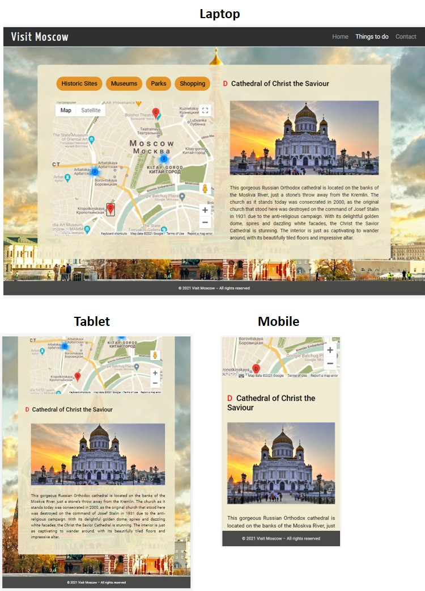
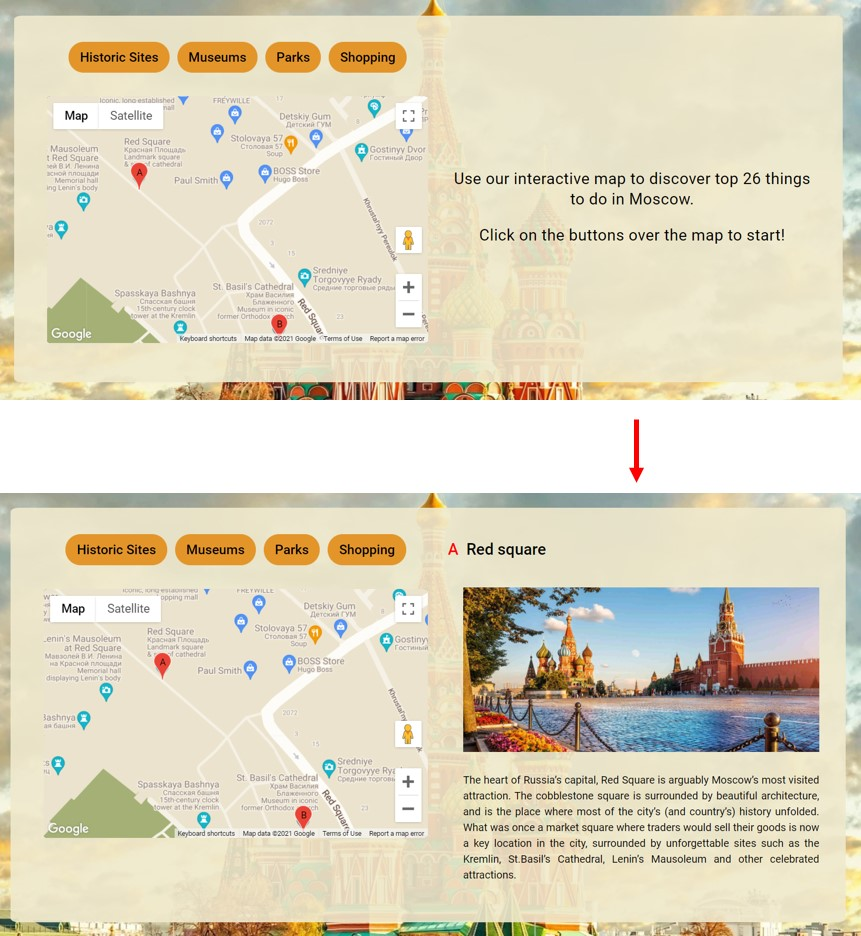

# Testing Functionality, Usability and Responsiveness

Functionality, Usability and Responsiveness of the key website elements were tested manually following the plan:

### Navigation bar:

  - The navbar automatically collapses at the lg (large) breakpoint (992px).

    

  - The current page is indicated by a white font colour (see an example above: *Home* button has a white colour).

  - All buttons of the navbar are clickable and open correct pages.

### Pages layout:

  - *Home* page rearrages correctly at certant breakpoints.

    

  - *Things to do* page rearrages correctly at certant breakpoints.

    

  - *Contact* page rearrages correctly at certant breakpoints.

    

### Weather:

  - The weather info loads correctly when the *Home* page is updated. 
  - At a certain breakpoint (415 px), the weather container jumps from the upper left corner to the bottom right corner.

### Things to do page layout:

  - At a certain breakpoint (600 px), the background image is placed over the map.

    

  - At certain breakpoints, the google map and info window rearange their layout.

    

### Google map:

  - Google map is displayable, all buttons are functional (e.g. zoom-in/zoom-out).

  - Google map is responsive and resizes itself correctly.

  - Google map displays Moscow (the map is centered on Moscow with a correct zoom). 

    

  - Locations markers (and clusters) are displayed when sightseeing buttons are clicked.

    

  - Info-window (with a photo and short description) appears when a corresponding marker is clicked.
    
    

  - For mobile devices, there is an automatic scrolling to the info window when markers are clicked.

  ### Contact form:

  - If trying to submit a form without filling out all fields, the error message "Please fill out this field" appears.

    

  - After a form submission, a message about succsessful/unsuccessful submission is displayed. 

    