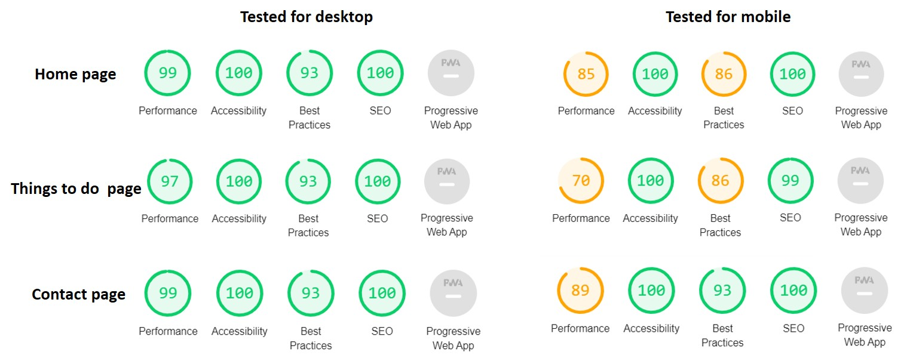

# Supplementary information

## Additional images

**Figure S1.** Result in W3C Markup Validator for all html files.

**Figure S2.** Result in W3C CSS Validator. 

**Figure S3.** Result in Lighthouse. 

**Figure S4.** Background image bug. 

