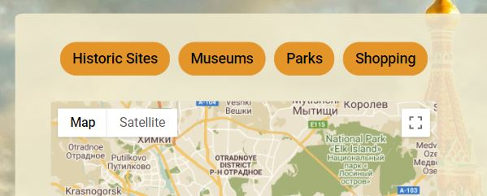

# Testing User Stories from User Experience (UX) Section

### I want to see a quick overview on Moscow city and form a first impression on it.

  - Upon entering the site, users are automatically greeted with a clean and easily readable navigation bar to go to the page of their choice. Underneath there is a full-screen background image with a Bootstap jumbotron-style component that catches the user's attention. 

  - Users can also notice an actual Moscow weather. 

    

  - Users can scroll down and read a short overview on Moscow attractions.

    

### I want to see different locations on a map to have a better understanding on how much far the locations are one from each other.

  - Users can click on *Things to do* page at the navigation bar. The *Things to do* page contains an interactive Google map with four buttons corresponding to different types of attractions (*Historic Sites*, *Museums*, *Parks* and *Shopping*). By clicking the buttons users can see the distribution of location markers on the map.

    

### I want to read more information and have a visual representation of the advertised locations.

  - When the markers are clicked, the info window containing an image and a short description is opened.

    

### I want to have an opportunity to ask for more info, advice or recommendation in organizing my trip.

  - Users can click on *Contact* page at the navigation bar. The *Contact* page contains a form to send a message with a question.

    

### I want to be able to easily navigate throughout the site to find content.

  - At the top of each page there is a clean navigation bar, each link describes what the page they will end up at clearly.

  - The logo title (*Visit Moscow*) always leads back to the *Home* page.

    

  - From *Home* page, it is possible to move directly to a *Contact form* page by clicking a *Contact Us!* button on the Bootstrap jumbotron style greeting message.

    

  - From *Home* page, it is possible to move directly to a *Things to do* page by clicking a *Discover More!* button.

    

  - Users can discover more detailed information on different types of attractions by clicking one of four buttons over the map. The buttons titles have intuitive names (*Historic Sites*, *Museums*, *Parks* and *Shopping*).

    

### I want to open the website from different devices (desktop/laptop/tablet/mobile devices).

  - Users can open the website from different devices.

    

